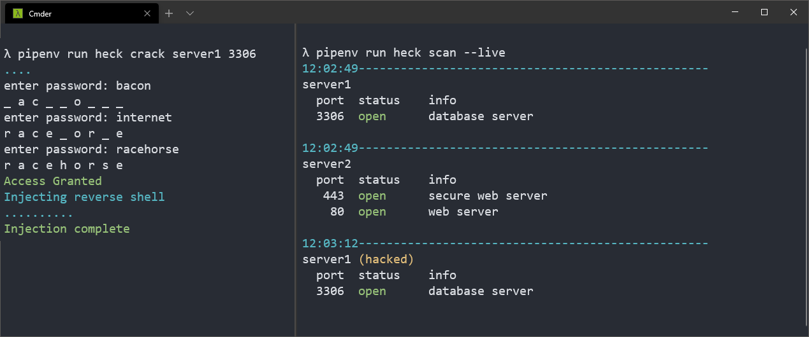

# heck

Hacking mini game Written in Python 3.8

## Prototype screenshot



## Install development environment

Install Python dependencies

```bash
# Install pipenv
pip install pipenv

# Install dependencies
pipenv sync
```

## Build binary

```bash
pipenv sync --dev
sh bin/build.sh

bin/dist/heck -h
# or windows
bin/dist/heck.exe -h
```

>*note*: it's recommended to put the binary in your PATH, but it's optional

# How to play

Before starting make sure to set a password in the docker-compose file

## Set up the database

```bash
docker-compose up -d
```

Put game objects into the database and create a config file

After running this command a `heck.conf` gets set in your current working directory

All subsequent game commands will use this config file to connect to the database

```bash
pipenv run heck init 127.0.0.1 the_password_you_set
# or if compiled to a binary or executable
heck init 127.0.0.1 the_password_you_set
```

show help text

```bash
pipenv run heck -h
# or
heck -h
```

Commands have sub arguments, for instances `heck scan --help` reveals a `--live` flag

```bash
usage: heck scan [-h] [--live]

optional arguments:
  -h, --help  show this help message and exit
  --live      output events as they occur
```

## Starting the mission

Get your mission briefing with the command

```bash
heck mission
```

To check if your mission succeeded of failed

```bash
heck mission --status
```

> *tip*: Use the scan tool while running the other commands in another console tab, for ultimate hackerman experience
